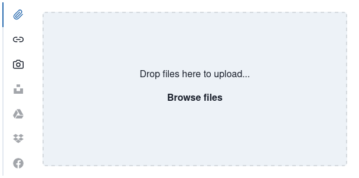

# image-uploader

[](https://github.com/facebook/jest)
[](https://github.com/prettier/prettier)
[](https://github.com/malcodeman/image-uploader/blob/master/LICENSE)

File picker inspired by [filestack](https://www.filestack.com/docs/uploads/pickers/web/).



## Getting started

```
git clone https://github.com/malcodeman/image-uploader.git
cd image-uploader
npm install
npm start
```

## License

[MIT](./LICENSE)
